# FINAL PJT: CINEFY

:clapper: 목차

> 팀원 정보 및 역할 분담
>
> 목표 서비스 구현 정도
>
> 개발 환경
>
> 프로젝트 구조
>
> 데이터베이스 모델링 (ERD)
>
> 필수 기능 및 추가 기능
>
> 배운 것 & 느낀 점

<br>

## 팀원 정보 및 역할 분담

### 원유진

- BACKEND

  - Movies: 영화 추천 알고리즘 - 감독&배우별 추천
  - Community: 리뷰, 댓글 CRUD

- FRONTEND

  - Accounts: 마이 페이지

  - Movies: 인덱스 페이지
  - Community: 리뷰 디테일 페이지

### 한우리

- BACKEND
  - Movies: 영화 추천 알고리즘 - 날짜 기반 추천
  - Accounts: 회원가입, 로그인, 로그아웃
- FRONTEND
  - Accounts: 회원가입, 로그인 validation
  - Movies: 영화 디테일 페이지
  - Community: 인덱스 페이지, 영화 OST 서비스
- 기타
  - JWT

<br>

## 목표 서비스 구현 정도

### 목표

- TMDB API에서 제공하는 영화 목록 외에 직접 데이터를 구성하여 추천 영화 목록 구성
- 여러 영화 사이트를 참고하여 비슷한 수준의 UI 제공
- Git을 통한 버전 관리 및 협업 (커밋 메세지 규칙을 따를 것)

### 구현 정도

- 싫어요를 기반으로 한 영화 추천, DB 자동 업데이트 기능, 유저 닉네임 기능을 제외하고 계획했던 거의 모든 기능을 구현 완료했음
- 프로젝트 마지막 날 교수님께서 피드백 해주신 내용 1개 제외하고 모두 반영 완료했음

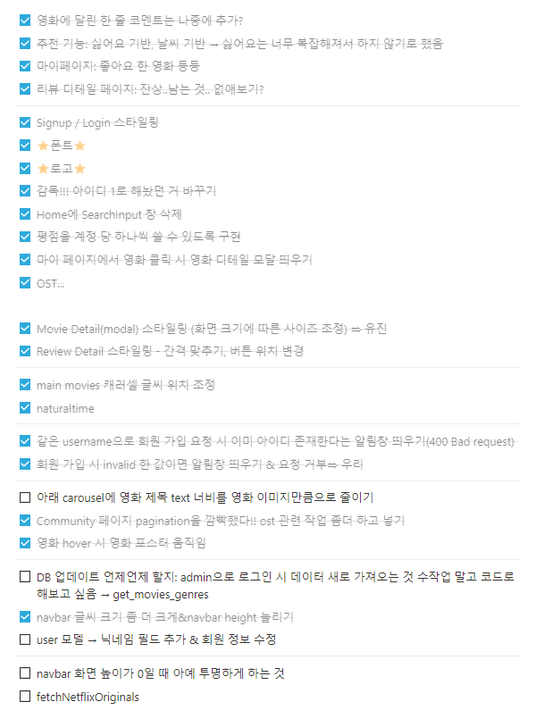

<br>

## 개발 환경

- Python 3.9.6
- Django 3.x
  - Django REST Framework
- Javascript
- Vue.js 2.x
  - Vuex
- SQLite3
- JWT

<br>

## 프로젝트 구조

- Front

  ```ba
  |   .env.local
  |   .gitignore
  |   babel.config.js
  |   package-lock.json
  |   package.json
  |   README.md
  |
  |
  +---node_modules
  |
  +---public
  |       favicon.ico
  |       favicon.png
  |       index.html
  |
  \---src
      |   App.vue
      |   main.js
      |
      +---api
      |       movie.js
      |       server.js
      |       youtube.js
      |
      +---assets
      |       album.png
      |       blank-profile-picture.png
      |       community-header.png
      |       logo.png
      |
      +---components
      |   +---community
      |   |       Comments.vue
      |   |
      |   +---layout
      |   |       MiniModal.vue
      |   |       Modal.vue
      |   |       Navbar.vue
      |   |       Sidebar.vue
      |   |
      |   +---movie
      |   |       MainMovies.vue
      |   |       MovieCards.vue
      |   |       MovieDetail.vue
      |   |       MovieList.vue
      |   |       MovieOst.vue
      |   |       Rating.vue
      |   |
      |   \---utils
      |           Player.vue
      |           SearchForm.vue
      |           Star.vue
      |           StarForm.vue
      |
      +---constant
      |       index.js
      |
      +---router
      |       index.js
      |
      +---store
      |       index.js
      |
      +---utils
      |       dayjs.js
      |       days.js
      |       validation.js
      |
      \---views
              Community.vue
              Home.vue
              Login.vue
              MyPage.vue
              ReviewDetail.vue
              ReviewEdit.vue
              Signup.vue
  ```

- Back

  ```bash
  |   .env
  |   .gitignore
  |   db.sqlite3
  |   manage.py
  |   README.md
  |   requirements.txt
  |
  +---accounts
  |   |   admin.py
  |   |   apps.py
  |   |   models.py
  |   |   serializers.py
  |   |   tests.py
  |   |   urls.py
  |   |   views.py
  |   |
  |   +---migrations
  |       |   0001_initial.py
  |       |   __init__.py
  |   
  |
  +---community
  |   |   admin.py
  |   |   apps.py
  |   |   models.py
  |   |   serializers.py
  |   |   tests.py
  |   |   urls.py
  |   |   views.py
  |   |   __init__.py
  |   |
  |   +---migrations
  |       |   0001_initial.py
  |       |   __init__.py
  |      
  |   
  |   
  |
  +---final_pjt_back
  |   |   asgi.py
  |   |   serializers.py
  |   |   settings.py
  |   |   urls.py
  |   |   wsgi.py
  |   |   __init__.py
  |   
  |   
  |
  +---movies
  |   |   admin.py
  |   |   apps.py
  |   |   models.py
  |   |   serializers.py
  |   |   tests.py
  |   |   urls.py
  |   |   views.py
  |   |   __init__.py
  |   |
  |   +---fixtures
  |   |       movies.json
  |   |
  |   +---migrations
  |       |   0001_initial.py
  |       |   0002_alter_rating_rank.py
  |       |   0003_auto_20211122_2011.py
  |       |   __init__.py
  |       
  |
  \---README.assets
  ```
  

<br>

## 데이터베이스 모델링 (ERD)

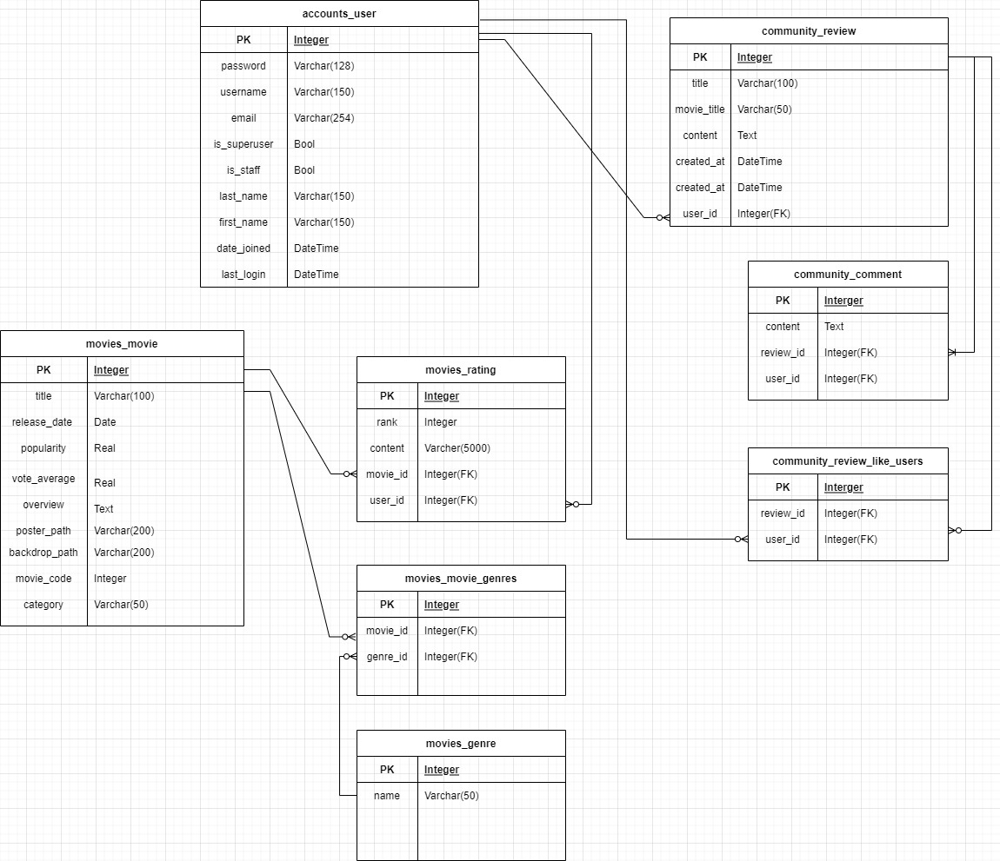

<br>

## 필수 기능 및 추가 기능

### 필수 기능

### Home

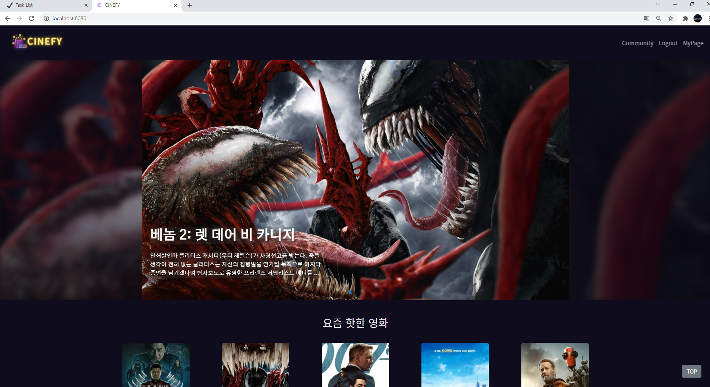

- 홈페이지에 들어오자마자 가장 처음에 보이는 Carousel에는 TMDB에서 backdrop_path를 받아와서 가로로 된 영화 이미지를 보여주었고, 여기에 양쪽으로 화면을 꽉 채우도록 배경을 줘서 사용자에게 몰입감을 주고자 했다.
- 대부분의 영화 포스터에서 어둡거나 다양한 색을 사용하므로 글씨 색을 흰색으로 주었고, 전체적으로 사용하고 있는 폰트와는 다른 폰트를 사용해서 좀 더 뚜렷하게 보일 수 있도록 했다.
- 아래에 있는 작은 Carousel이 총 8개가 있어서 화면이 길기 때문에, 사용자가 스크롤을 올리지 않아도 위로 올라갈 수 있도록 TOP 버튼을 만들었다.
- 메인 컬러인 노랑, 보라색에 맞추어 배경에는 검정색에 가까운 보라색을 사용하고 로고에는 보라색, 노란색의 네온 로고를 사용했다.
- 직접 구성한 영화 추천 알고리즘은 총 4가지가 있다. 첫 번째로는 계절에 맞는 영화를 추천하고자 작년 이번 달에 개봉한 영화를 보여주었다. 보통 영화들을 생각했을 때 여름에는 여름 분위기의 영화가, 겨울에는 겨울 분위기의 영화가 개봉하므로 해당 로직을 사용했다. 나머지는 배우별, 감독별, 장르별 영화 추천인데 로그인을 하지 않았을 경우에는 DB에 있는 영화 목록 중에서 한 가지를 랜덤으로 선택해서 메인 배우 1명, 감독을 선택하고 DB에 있는 장르 목록 중 한 가지를 선택하여 추천 영화 목록을 구성했다. 로그인을 한 유저가 2개 이상의 영화에 7점 이상의 평점을 남겼을 경우에는 7점 이상의 평점을 매긴 영화들 중에서 랜덤으로 영화를 선택해서 추천 영화 목록을 구성했다.

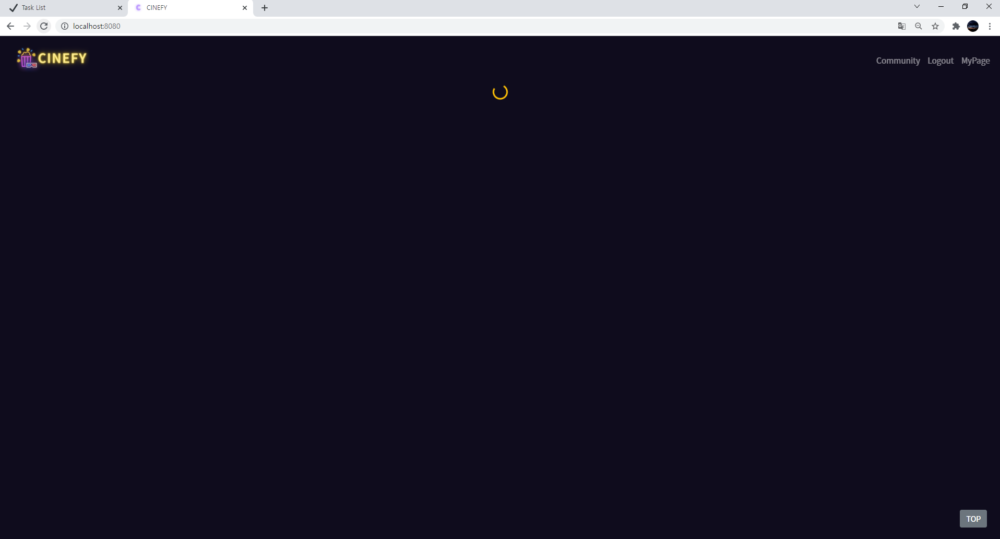

- 데이터가 로딩 중일 때는 spinner를 띄워서 사용자가 아무것도 없는 빈 창을 보지 않도록 했다.

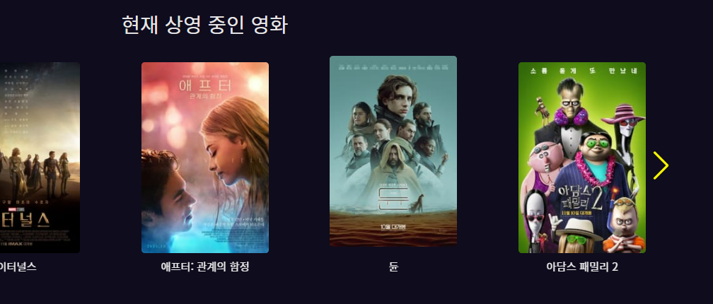

- 사용자 경험 향상을 위해 아래에 있는 Carousel에는 hover 효과를 주었다. '듄' 영화 포스터 이미지에 hover 했을 때 위 사진과 같이 이미지가 위로 움직인다.

### 영화 Detail

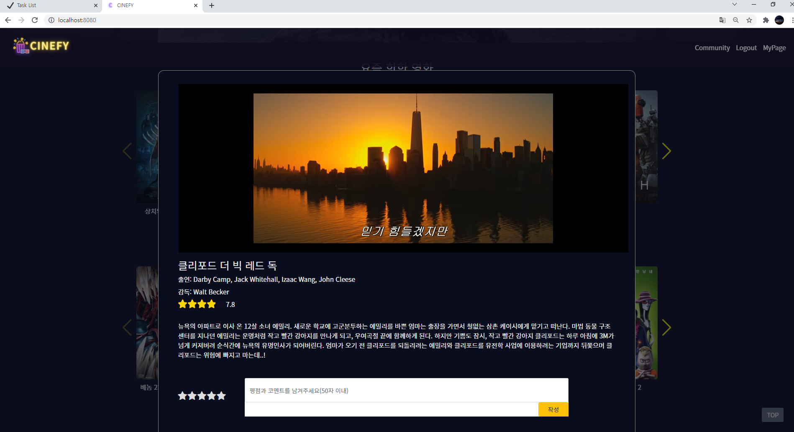

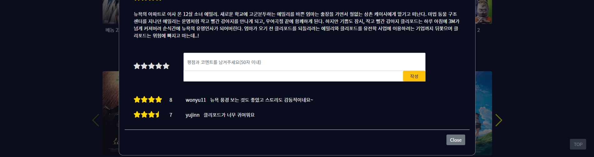

- 영화 디테일 페이지에서는 유튜브에서 해당 영화의 트레일러를 검색해서 보여주었고, 이 때 사용자의 몰입감을 위해 영상 크기가 모달의 너비를 어느 정도 채우도록 했다.
- 평점에서 별점을 남길 때 hover 효과를 통해 별을 몇 개 채울지, 반만 채울지 하나를 다 채울지 결정할 수 있는데 이 때 사용자에게 좀 더 잘 보이도록 별의 배경인 회색과 반대되는 보라색을 사용했다.
- 평점이 영어로 작성되어 있을 경우 모달 밖으로 튀어나오는 것을 방지하기 위해 제한을 50자로 두었다.

### 회원가입

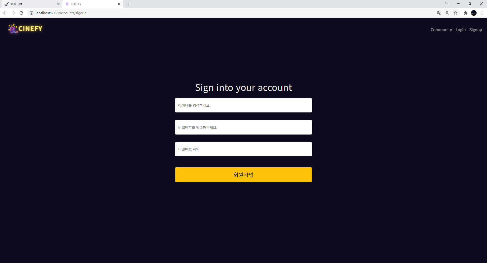

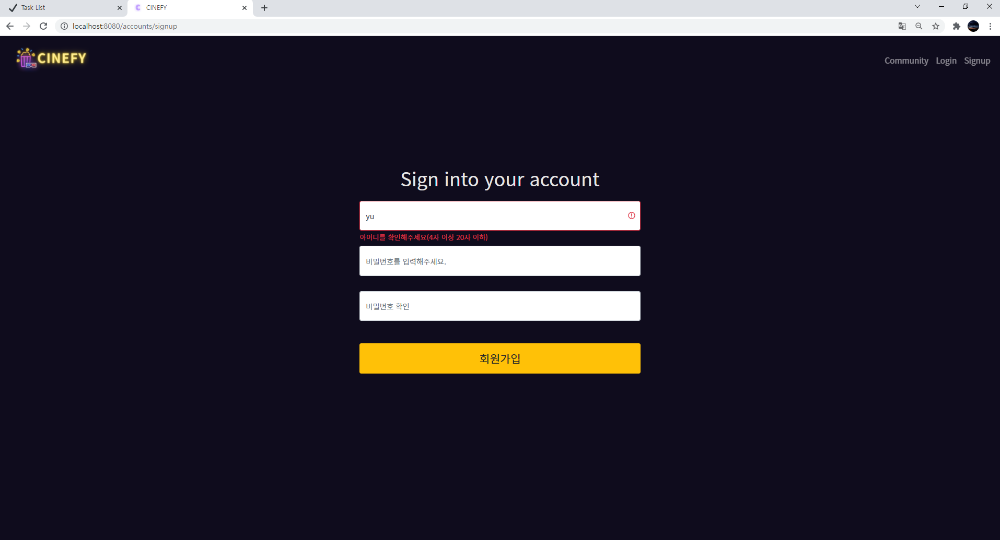

- 회원가입 및 로그인 폼은 화면의 가운데에 배치했다. 정렬을 위해 input에 대해 label은 따로 작성하지 않았고 placeholder를 사용해서 어떤 인풋에 무엇을 입력해야 할 지 알 수 있게 했다. 또한 한 글자라도 입력을 했을 경우에만 validation check 메세지를 띄운다.

### 로그인

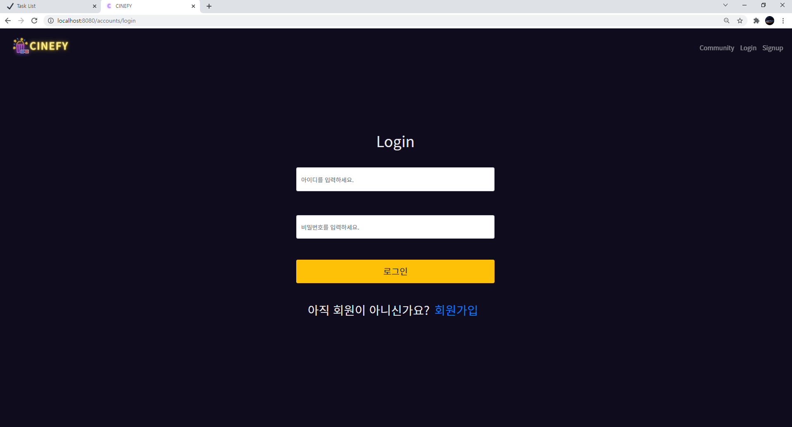

- 기존 사이트에서는 로그인 창에 회원가입 링크가 존재하는 경우가 많으므로 이 점을 참고해서 회원가입 링크를 추가했다.

### 마이페이지

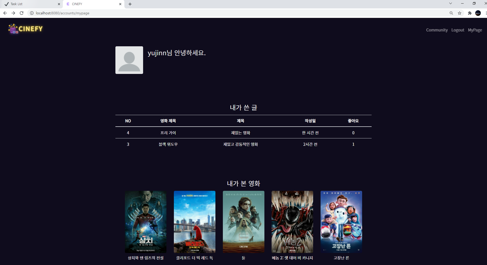

- 프로필 사진을 따로 등록할 수는 없지만 이미지가 없는 경우 보여줄 정보에 비해 공백이 많아서 기본 이미지를 추가했다.
- 내가 쓴 글을 보여줄 때는 교수님의 피드백을 반영해서 작성자 이름 필드는 제외했다. 클릭할 경우 해당 글의 디테일 페이지로 이동한다.
- 내가 본 영화에는 내가 평점을 남긴 영화 목록을 보여준다. 각 아이템을 클릭할 경우 영화 디테일 페이지 모달 창을 띄운다.

### Community

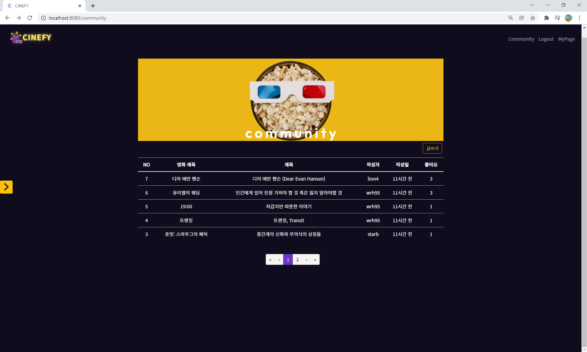

- 커뮤니티의 인덱스 페이지에서는 헤더 이미지를 추가했고, 페이지네이션을 추가해서 한 페이지 당 글을 5개씩 볼 수 있도록 구성했다. active된 페이지에는 메인 컬러 중 하나인 보라색을 사용했고 각 게시글에 hover했을 경우 어떤 글을 보고자 하는지 알 수 있게 하기 위해 row가 흰 색으로 바뀌는 효과를 주었다.

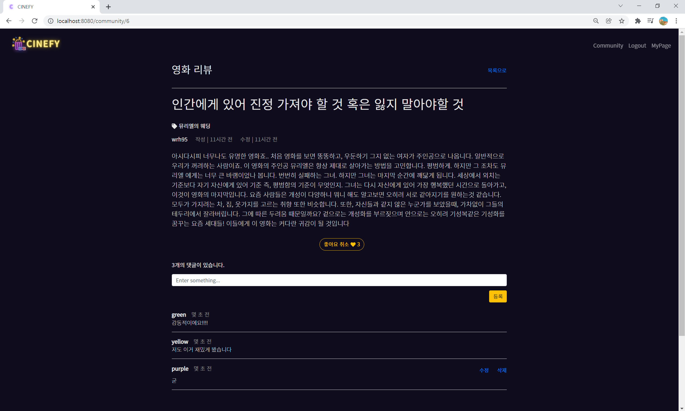

- 리뷰 디테일 페이지에서는 정렬을 맞추고 각 요소(뒤로가기 버튼, 작성시각 등)의 위치를 어색하지 않게 구성하는 데에 집중했다. 각 리뷰에는 좋아요를 누를 수 있고 작성자만 수정 및 삭제를 할 수 있으며 댓글 또한 작성자만 수정 및 삭제를 할 수 있다. 

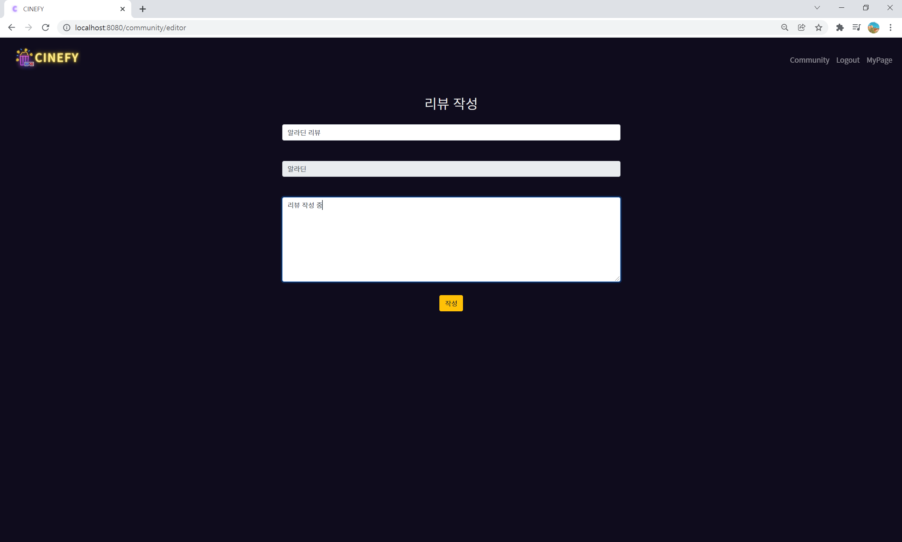

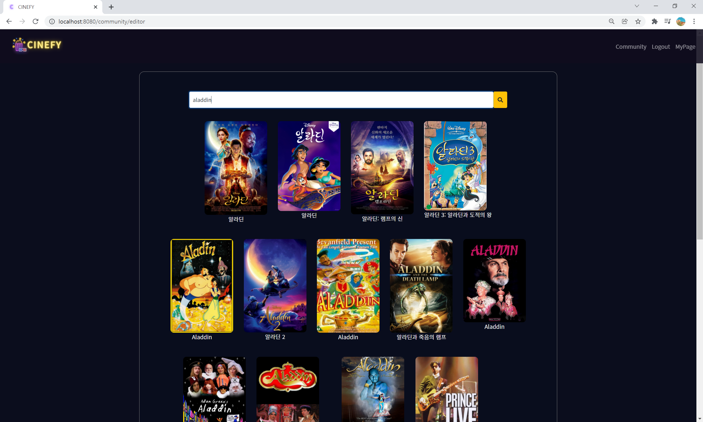

- 리뷰를 작성할 때는 해당하는 영화를 검색할 수 있도록 모달 창을 만들었다. 해당 모달은 영화 디테일 페이지에서 쓰이는 모달과 같은 것을 재사용한 것이다. debounce를 통해 검색어에 해당하는 영화의 목록이 검색될 수 있도록 했고 영화를 선택했을 경우 해당 영화의 제목이 인풋에 바로 입력된다.

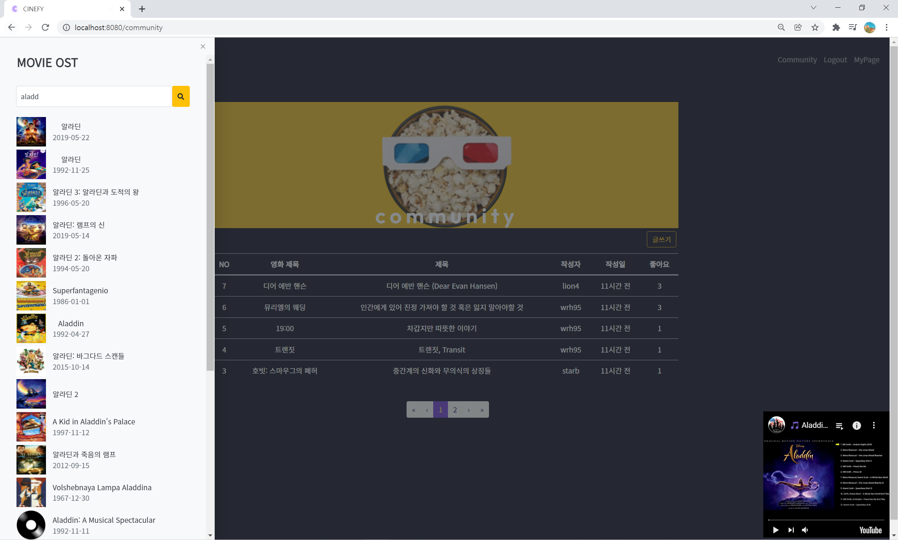

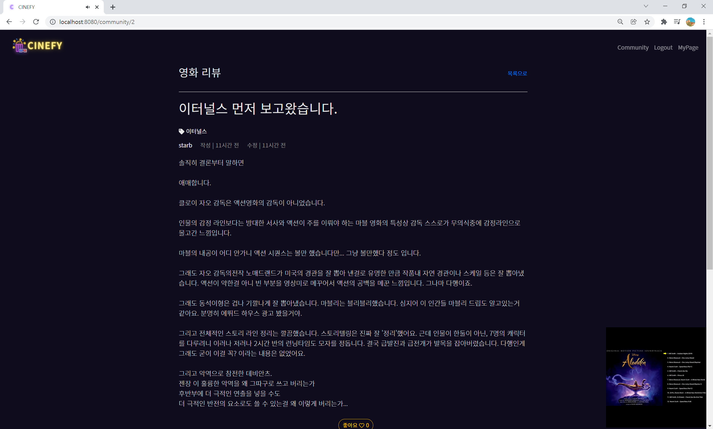

- 우리 서비스만의 기능을 추가해보라고 하신 교수님의 피드백에 따라 영화 OST 플레이 기능을 만들었다. 커뮤니티 메인 페이지에서 오른쪽 화살표 모양 버튼을 만들어 해당 버튼을 클릭하면 왼쪽에서 무언가 등장할 것임을 알려주었고, 해당 버튼을 클릭하면 영화 OST를 검색할 수 있는 사이드바가 나오도록 구성했다. 여기에 있는 검색 폼은 리뷰 작성에서의 영화 검색 폼을 재사용한 것이며 여기서도 debounce가 적용된다.
- OST 소형 플레이어는 영화 디테일 페이지에 있는 트레일러 재생 플레이어를 재사용한 것이며, 커뮤니티 인덱스 화면 및 리뷰 디테일 페이지에서 계속해서 보일 수 있도록 했다.

<br>

## 배운 것 & 느낀 점

### 원유진

- 프로젝트 초기에 완벽한 계획을 세우기는 어렵다는 것, 구현하고자 했던 걸 전부 다 완벽히 해냈는지보다는 주어진 시간 내에 결과물을 잘 완성했는지가 더 중요하다는 것, 내가 맡은 부분은 내가 책임지고 해내되 잘 안 풀리는 문제는 팀원과 공유할 때 오히려 금방 해결된다는 것 등 처음으로 진행한 진짜 프로젝트였던 만큼 배운 것이 많았다. 추가하고 싶고 개선하고 싶은 기능이 여전히 남아 있지만 일주일 동안 모든 것을 쏟아 부었기 때문에 후회는 남지 않는다!
- 처음에는 만족할만한 프로젝트를 만들어낼 수 있을지, 시간 안에 제대로 완성할 수 있을지 걱정이 되기도 했다. 하지만 잘 해결되지 않는 에러를 공유할 때마다 함께 해결해주시고 매일 밤마다 그리고 주말에도 함께 열심히 해주신 우리님 덕분에 힘을 내고 더 열심히 해서 프로젝트를 완성할 수 있었다. 얼만큼 역할을 잘 나누고 각자 할 일을 하는지도 중요하지만 함께 열심히 하고 있다는 것을 알고 있다는 사실도 중요한 것 같다고 생각했다.

### 한우리

- 싸피 5개월 인생에서 가장 다사다난했지만 그만큼 배운 것도 많은 한 주 였다. 이것저것 해보고 싶은 게 많아서 욕심을 많이 냈는데, 도중에 생각만큼 안 풀려서 시간을 많이 잡아 먹기도 했다. 하지만 각자의 역할을 명확하게 나누고 하나씩 차근차근 해나가니까 프로젝트가 점점 더 쌓이면서 결국 목표를 달성할 수 있었다. 팀원 분이 있어서 정말 든든했고 이런게 팀플이구나 라는 것을 느낄 수 있었다.

